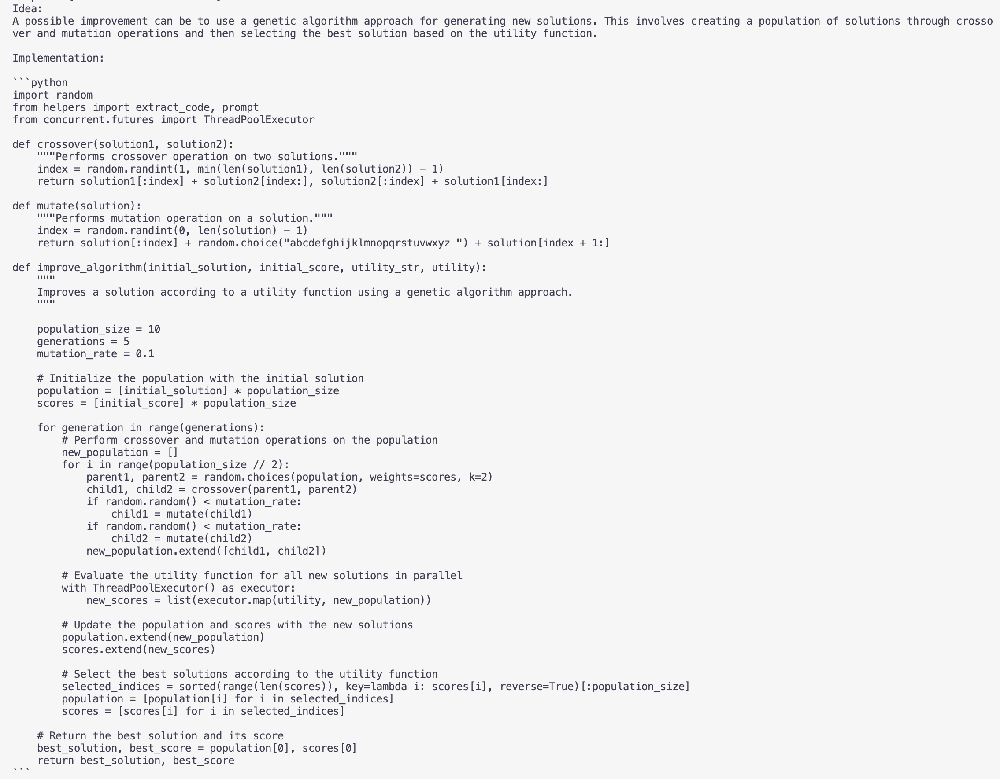

# stop-reproduction

This repo contains code in attempt to reproduce [STOP: Self-Taught Optimizer](https://arxiv.org/abs/2310.02304) (3 October 2023). Revised paper [here](https://openreview.net/pdf?id=1gkePTsAWf) (19 November 2023).

All credit goes to the authors of the original paper.

## Testing

`task.txt` contains seed solutions and seed improvers for ease of testing. It is not used in the code. 

To select candidate code for improvement, copy interested task/code from `task.txt` into `task.py` before running.

To run, use with desired task in `task.py`:
```
python run.py
```

## Results
We saw genetic algorithm being implemented as the improver after 3rd iteration of STOP on Seed Improver. The paper notes this as well.


## References
```
@misc{zelikman2023selftaught,
      title={Self-Taught Optimizer (STOP): Recursively Self-Improving Code Generation}, 
      author={Eric Zelikman and Eliana Lorch and Lester Mackey and Adam Tauman Kalai},
      year={2023},
      eprint={2310.02304},
      archivePrefix={arXiv},
      primaryClass={cs.CL}
}
```
